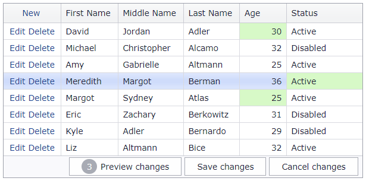

<!-- default badges list -->

[](https://supportcenter.devexpress.com/ticket/details/E5046)
[](https://docs.devexpress.com/GeneralInformation/403183)
<!-- default badges end -->
# Grid View for ASP.NET MVC - Implement the batch edit functionality
<!-- run online -->
**[[Run Online]](https://codecentral.devexpress.com/e5046/)**
<!-- run online end -->

This example demonstrates how to enable the grid's batch edit mode and use a controller action method to update grid data.



## Overview

In batch edit mode, the grid allows users to modify data in batches and send them to the server in one request. Set the grid's [SettingsEditing.Mode](https://docs.devexpress.com/AspNet/DevExpress.Web.ASPxGridViewEditingSettings.Mode) property to `Batch` to enable the grid's batch edit functionality.

```cshtml
settings.SettingsEditing.Mode = GridViewEditingMode.Batch;
```

To enable batch edit operations, add a controller action method. This method obtains a [MVCxGridViewBatchUpdateValues](https://docs.devexpress.com/AspNetMvc/DevExpress.Web.Mvc.MVCxGridViewBatchUpdateValues-2) object as a parameter. Use the object's [Update](https://docs.devexpress.com/AspNetMvc/DevExpress.Web.Mvc.MVCxBatchUpdateValues-2.Update), [Insert](https://docs.devexpress.com/AspNetMvc/DevExpress.Web.Mvc.MVCxBatchUpdateValues-2.Insert), and [DeleteKeys](https://docs.devexpress.com/AspNetMvc/DevExpress.Web.Mvc.MVCxBatchUpdateValues-2.DeleteKeys) properties to get infomation about modified, inserted, and deleted grid rows.

```cs
public ActionResult BatchEditingUpdateModelPerson(MVCxGridViewBatchUpdateValues<Person, int> batchValues) {
    foreach(var person in batchValues.Update) {
        if(batchValues.IsValid(person))
            PersonsList.UpdatePerson(person);
        else
            batchValues.SetErrorText(person, "Correct validation errors");
    }
    foreach(var person in batchValues.Insert) {
        if(batchValues.IsValid(person))
            PersonsList.AddPerson(person);
        else
            batchValues.SetErrorText(person, "Correct validation errors");
    }
    foreach (var personID in batchValues.DeleteKeys) {
        PersonsList.DeletePerson(personID);
    }
    return PartialView("GridViewPartial", PersonsList.GetPersons());
}
```

## Files to Review

* [HomeController.cs](./CS/DXWebApplication1/Controllers/HomeController.cs) (VB: [HomeController.vb](./VB/DXWebApplication1/Controllers/HomeController.vb))
* [PersonsList.cs](./CS/DXWebApplication1/Models/PersonsList.cs) (VB: [PersonsList.vb](./VB/DXWebApplication1/Models/PersonsList.vb))
* [_GridViewPartial.cshtml](./CS/DXWebApplication1/Views/Home/_GridViewPartial.cshtml)

## Documentation

* [Grid in Batch Edit Mode](https://docs.devexpress.com/AspNetMvc/16147/components/grid-view/data-editing-and-validation/batch-edit)
* [ASP.NET WebForms & MVC: GridView Batch Edit (What's new in 13.2)](https://community.devexpress.com/blogs/aspnet/archive/2013/12/16/asp-net-webforms-amp-mvc-gridview-batch-edit-what-39-s-new-in-13-2.aspx)

## More Examples

* [Batch Editing](https://demos.devexpress.com/MVCxGridViewDemos/Editing/BatchEditing)
* [Grid View for ASP.NET Web Forms - A simple batch edit implementation](https://github.com/DevExpress-Examples/aspxgridview-simple-batch-editing-implementation)
